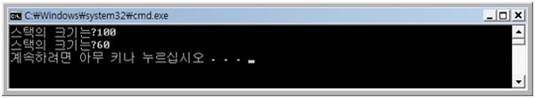

					<b>제공:</b> <a href="http://network.hanb.co.kr/">한빛 네트워크</a> 
<b>저자:</b> 최흥배 
<b>이전기사:</b>
<ul>
  <li><a href="http://network.hanb.co.kr/view.php?bi_id=1563">About STL : C++ STL 프로그래밍(1)</a>
  </li><li><a href="http://network.hanb.co.kr/view.php?bi_id=1567">About STL : C++ STL 프로그래밍(2-1)</a>
</li></ul>
<a href="http://network.hanb.co.kr/view.php?bi_id=1567">이전 기사에서는 함수 템플릿</a>에 대해 설명을 했으니 이번에는 클래스 템플릿에 대해서 설명하려고 합니다. 클래스 템플릿을 아주 간단하게 말하면 함수 템플릿이 함수에 템플릿을 사용한 것처럼 클래스 템플릿은 클래스에 템플릿을 사용한 것입니다.
  
그러니 함수 템플릿에 대해서 잘 모르시는 분은 꼭 함수 템플릿에 대한 글을 먼저 보고 이 글을 보는 것이 이해하기에 좋습니다.

<h3>경험치 변경 이력 저장</h3>

기획팀에서 유저들이 게임에 접속하여 다른 유저들과 100번의 게임을 했을 때 유저들의 경험치가 변경 되는 이력을 볼 수 있기를 요청 하였습니다.
  
기획팀의 요구를 들어주기 위해서 저는 게임이 끝날 때마다 경험치를 저장합니다. 또 경험치 이력 내역을 출력할 때 가장 최신에서 가장 오랜 된 것을 보여줘야 되기 때문에 스택(stack)이라는 자료 구조를 사용합니다.

> 스택은 자료 구조 중의 하나로 가장 마지막에 들어 온 것을 가장 먼저 꺼내는 LIFO(Last In First Out) 형식으로 되어 있습니다. 데이터를 넣을 때를 push, 빼낼 때는 pop이라는 이름을 일반적으로 사용한다.

경험치 이력을 저장하는 클래스의 구현과 이것을 사용하는 것은 아래와 같습니다.
  
<list1>
<pre>// 경험치를 저장할 수 있는 최대 개수
const int MAX_EXP_COUNT = 100;

// 경험치 저장 스택 클래스
class ExpStack
{
public:
  ExpStack()
  {
    Clear();
  }

  // 초기화 한다.
  void Clear()
  {
    m_Count = 0;
  }

  // 스택에 저장된 개수
  int Count()
  {
    return m_Count;
  }

        // 저장된 데이터가 없는가?
  bool IsEmpty()
  {
    return 0 == m_Count ? true : false;
  }

  // 경험치를 저장한다.
  bool push( float Exp )
  {
    // 저장할 수 있는 개수를 넘는지 조사한다.
    if( m_Count >= MAX_EXP_COUNT )
    {
      return false;
    }

    // 경험치를 저장 후 개수를 하나 늘린다.
    m_aData[ m_Count ] = Exp;
    ++m_Count;

    return true; 
  }

  // 스택에서 경험치를 빼낸다.
  float pop()
  {
    // 저장된 것이 없다면 0.0f를 반환한다.
    if( m_Count  < 1 )
    {
      return 0.0f;
    }

    // 개수를 하나 감소 후 반환한다.
    --m_Count;
    return m_aData[ m_Count ];
  }

private:
  float  m_aData[MAX_EXP_COUNT];
  int    m_Count;
};

#include <iostream>

using namespace std;

void main()
{
  ExpStack kExpStack;
  
  cout << "첫번째 게임 종료- 현재 경험치 145.5f" << endl;
  kExpStack.push( 145.5f );

  cout << "두번째 게임 종료- 현재 경험치 183.25f" << endl;
  kExpStack.push( 183.25f );

  cout << "세번째 게임 종료- 현재 경험치162.3f" << endl;
  kExpStack.push( 162.3f );

  int Count = kExpStack.Count();
  for( int i = 0; i < Count; ++i )
  {
    cout << "현재 경험치->" << kExpStack.pop() << endl;
  }
}
</iostream></pre>
실행 결과
  

  
실행 결과를 보면 알 수 있듯이 스택 자료구조를 사용하였기 때문에 제일 뒤에 넣은 데이터가 가장 제일 먼저 출력 되었습니다.

<h3>게임 돈 변경 이력도 저장해 주세요</h3>

경험치 변경 이력을 저장하고 출력하는 기능을 만들어서 기획팀에 보여주니 이번에는 게임 돈의변경 이력도 보고 싶다고 말합니다. 
  
위에서 경험치 변경 이력 저장 기능을 만들어 보았으니 금방 할 수 있는 것이죠. 그래서 이번에는 이전 보다 훨씬 더 빨리 만들었습니다.
  
<list2>
<pre>// 돈을 저장할 수 있는 최대 개수
const int MAX_MONEY_COUNT = 100;

// 돈 저장 스택 클래스
class MoneyStack
{
public:
  MoneyStack()
  {
    Clear();
  }

  // 초기화 한다.
  void Clear()
  {
    m_Count = 0;
  }

  // 스택에 저장된 개수
  int Count()
  {
    return m_Count;
  }

  // 저장된 데이터가없는가?
  bool IsEmpty()
  {
    return 0 == m_Count ? true : false;
  }

  // 돈을 저장한다.
  bool push( __int64 Money )
  {
    // 저장 할 수 있는 개수를 넘는지 조사한다.
    if( m_Count >= MAX_MONEY_COUNT )
    {
      return false;
    }

    // 저장후 개수를 하나 늘린다.
    m_aData[ m_Count ] = Money;
    ++m_Count;

    return true; 
  }

  // 스택에서 돈을 빼낸다.
  __int64 pop()
  {
    // 저장된 것이 없다면 0을 반환한다.
    if( m_Count  < 1 )
    {
      return 0;
    }

    // 개수를 하나 감소 후 반환한다.
    --m_Count;
    return m_aData[ m_Count ];
  }

private:
  __int64  m_aData[MAX_MONEY_COUNT];
  int  m_Count;
};
</pre>
<b>ExpStack 클래스와 MoneyStack 클래스가 비슷합니다</b>
  
게임 돈 변경 이력 저장 기능을 가지고 있는 MoneyStack 클래스를 만들고 보니 앞에 만든 ExpStack와 거의 같습니다. 저장하는 데이터의 자료형만 다를뿐이지 모든 것이 같습니다. 그리고 기획팀에서는 게임 캐릭터의 Level 변경 이력도 저장하여 보여주기를 바라는 것 같습니다. 이미 거의 똑같은 클래스를 두개 만들었고 앞으로도 기획팀에서 요청이 있으면 더 만들 것 같습니다. 이렇게 자료형만 다른 클래스를 어떻게 하면 하나의 클래스로 정의 할수 있을까요? 이와 비슷한 문제를 이전의 "함수 템플릿"에서도 나타나지 않았나요?  그때 어떻게 해결했죠?(생각나지 않는 분들은 앞의 "함수 템플릿"을 다시 한번 봐 주세요 ^^)
  
<b>템플릿으로 하면됩니다.</b>
  
기능은 같지만 변수의 자료형만 다른 함수를 템플릿을 사용하여 하나의 함수로 정의했듯이 이번에는 템플릿을 사용하여 클래스를 정의합니다.
클래스에서 템플릿을 사용하면 이것을 클래스 템플릿이라고 합니다. 클래스 템플릿을 사용하면 위에서 중복된 클래스를 하나의 클래스로 만들 수 있습니다.

<h3>클래스 템플릿을 사용하는 방법</h3>

클래스 템플릿을 정의하는 문법은 아래와 같습니다.
  

  
정의한 클래스 템플릿을 사용하는 방법은 아래와 같습니다.
   

<h3>Stack 템플릿 클래스</h3>

지금까지 만들었던 ExpStack 과 MoneyStack을 클래스 템플릿으로 만든 코드는 아래와 같습니다.
  
<list3>
<pre>const int MAX_COUNT = 100;

template<typename t=""> 
class Stack
{
public:
  Stack()
  {
    Clear();
  }

  // 초기화 한다.
  void Clear()
  {
    m_Count = 0;
  }

  // 스택에 저장된 개수
  int Count()
  {
    return m_Count;
  }

  // 저장된 데이터가 없는가?
  bool IsEmpty()
  {
    return 0 == m_Count ? true : false;
  }

  // 데이터를 저장한다.
  bool push( T data )
  {
    // 저장 할수 있는 개수를 넘는지 조사한다.
    if( m_Count >= MAX_COUNT )
    {
      return false;
    }

    // 저장후 개수를 하나 늘린다.
    m_aData[ m_Count ] = data;
    ++m_Count;

    return true; 
  }

  // 스택에서 빼낸다.
  T pop()
  {
    // 저장된 것이 없다면 0을 반환한다.
    if( m_Count  < 1 )
    {
      return 0;
    }

    // 개수를 하나 감소 후 반환한다.
    --m_Count;
    return m_aData[ m_Count ];
  }

private:
  T  m_aData[MAX_COUNT];
  int    m_Count;
};

#include <iostream>

using namespace std;

void main()
{
  Stack<float> kStackExp;
  
  cout << "첫번째 게임 종료- 현재 경험치 145.5f" << endl;
  kStackExp.push( 145.5f );

  cout << "두번째 게임 종료- 현재 경험치 183.25f" << endl;
  kStackExp.push( 183.25f );

  cout << "세번째 게임 종료- 현재 경험치 162.3f" << endl;
  kStackExp.push( 162.3f );

  int Count = kStackExp.Count();
  for( int i = 0; i < Count; ++i )
  {
    cout << "현재 경험치->" << kStackExp.pop() << endl;
  }

  cout << endl << endl;

  Stack<__int64> kStackMoney;
  
  cout << "첫번째 게임 종료- 현재 돈 1000023" << endl;
  kStackMoney.push( 1000023 );

  cout << "두번째 게임 종료- 현재 돈 1000234" << endl;
  kStackMoney.push( 1000234 );

  cout << "세번째 게임 종료- 현재 돈 1000145" << endl;
  kStackMoney.push( 1000145 );

  Count = kStackMoney.Count();
  for( int i = 0; i < Count; ++i )
  {
    cout << "현재 돈->" << kStackMoney.pop() << endl;
  }
}
</float></iostream></typename></pre>
실행 결과
  

  
클래스 템플릿으로 Stack을 구현하여 앞으로 다양한 데이터를 사용할 수 있게 되었습니다.
  
그런데 위의 Stack 클래스는 부족한 부분이 있습니다. 앞으로 이 부족한 부분을 채워 나가면서 클래스 템플릿에 대해서 좀 더 알아 보겠습니다.

<h3>클래스 템플릿에서 non-type 파라메터 사용</h3>

위에서 만든 Stack 클래스는 데이터를 저장할 수 있는 공간이 100개로 정해져 있습니다. Stack의 크기는 사용하는 곳에 따라서 변동될 수 있어야 사용하기에 적합합니다.
  
함수 템플릿을 설명할 때도 non-type이 나왔는데 사용 방법이 거의 같습니다. 템플릿 파라메터를 기본 데이터 형으로 합니다. 아래의 사용 예를 보시면 금방 이해가 갈 것입니다.
  
<list4>
<pre>// 템플릿 파라메터중 int Size가 non-type  파라메터입니다.
template<typename t,="" int="" size=""> 
class Stack
{
public:
  Stack()
  {
    Clear();
  }

  // 초기화 한다.
  void Clear()
  {
    m_Count = 0;
  }

  // 스택에 저장된 개수
  int Count()
  {
    return m_Count;
  }

  // 저장된 데이터가 없는가?
  bool IsEmpty()
  {
    return 0 == m_Count ? true : false;
  }

  // 데이터를 담을수 있는 최대 개수
  int GetStackSize()
  {
    return Size;
  }

  // 데이터를 저장한다.
  bool push( T data )
  {
    // 저장할 수 있는 개수를 넘는지 조사한다.
    if( m_Count >= Size )
    {
      return false;
    }

    // 저장 후 개수를 하나 늘린다.
    m_aData[ m_Count ] = data;
    ++m_Count;

    return true; 
  }

  // 스택에서 빼낸다.
  T pop()
  {
    // 저장된 것이 없다면 0을 반환한다.
    if( m_Count  < 1 )
    {
      return 0;
    }

    // 개수를 하나 감소 후 반환한다.
    --m_Count;
    return m_aData[ m_Count ];
  }

private:
  T  m_aData[Size];
  int  m_Count;
};

#include <iostream>

using namespace std;

void main()
{
  Stack<int, 100=""> kStack1;
  cout << "스택의 크기는?" << kStack1.GetStackSize() << endl;

  Stack<float, 60=""> kStack2;
  cout << "스택의 크기는?" << kStack2.GetStackSize() << endl;
}
</float,></int,></iostream></typename></pre>
실행 결과
  

<h3>템플릿 파라메터 디폴트 값 사용</h3>

일반 함수에서 함수 인자의 디폴트 값을 지정하듯이 클래스 템플릿의 파라메터도 디폴트 값으로 할 수 있습니다.
  
<list5>
<pre>// 템플릿 파라메터중 int Size가 non-type 파라메터입니다. 
// Size의 디폴트 값을 100으로 합니다.
template<typename t,="" int="" size="100"> 
class Stack
{
   …..  생략
}

void main()
{
  Stack<int, 64=""> kStack1;
  cout << "스택의크기는?" << kStack1.GetStackSize() << endl;

  Stack<float, 60=""> kStack2;
  cout << "스택의크기는?" << kStack2.GetStackSize() << endl;
}
</float,></int,></typename></pre>
List5에서 템플릿 파라메터 중 Size의 값을 디폴트 100으로 했습니다. 클래스를 생성할 때 두 번째 파라메터 값을 지정하지 않으면 디폴트 값이 사용 됩니다.
  
실행 결과
  

<h3>스택 클래스의 크기를 클래스 생성자에서 지정</h3>

클래스 템플릿에 대한 설명을 계속 하기 위해 현재까지 만든 스택 클래스를 변경합니다. 스택의 크기를 클래스 템플릿 파라메터가 아닌 생성자에서 지정하도록 변경하겠습니다.
  
<list6>
<pre>template<typename t,="" int="" size="100"> 
class Stack
{
public:
  explicit Stack( int size )
  {
    m_Size = size;
    m_aData = new T[m_Size];

    Clear();
  }

  ~Stack()
  {
    delete[] m_aData;
  }

  // 초기화 한다.
  void Clear()
  {
    m_Count = 0;
  }

  // 스택에 저장된 개수
  int Count()
  {
    return m_Count;
  }

  // 저장된 데이터가 없는가?
  bool IsEmpty()
  {
    return 0 == m_Count ? true : false;
  }

  // 데이터를 담을 수 있는 최대 개수
  int GetStackSize()
  {
    return m_Size;
  }

  // 데이터를 저장한다.
  bool push( T data )
  {
    // 저장할 수 있는 개수를 넘는지 조사한다.
    if( m_Count >= m_Size )
    {
      return false;
    }

    // 저장 후 개수를 하나 늘린다.
    m_aData[ m_Count ] = data;
    ++m_Count;

    return true; 
  }

  // 스택에서 빼낸다.
  T pop()
  {
    // 저장된 것이 없다면 0을 반환한다.
    if( m_Count  < 1 )
    {
      return 0;
    }

    // 개수를 하나 감소 후 반환한다.
    --m_Count;
    return m_aData[ m_Count ];
  }

private:
  T*  m_aData;
  int  m_Count;

  int m_Size;
};

#include <iostream>

using namespace std;

void main()
{
  Stack<int> kStack1(64);
  cout << "스택의 크기는? " << kStack1.GetStackSize() << endl;
}
</int></iostream></typename></pre>
실행결과
  

  
List 6의 코드에서 잘 보지 못한 키워드가 있을 것입니다. 바로 explicit 입니다. explicit 키워드로 규정된 생성자는 암시적인 형 변환을 할 수 없습니다. 그래서 List6의 void main()에서
<pre>  Stack<int> kStack1 = 64; 
</int></pre>
로 클래스를 생성하면 컴파일 에러가 발생합니다.

<h3>클래스 템플릿 전문화</h3>

기획팀에서 새로운 요구가 들어왔습니다. 이번에는 게임을 할 때 같이 게임을 했던 유저의 아이디를 저장하여 보여주기를 원합니다. 지금까지 만든 Stack 클래스는 기본 자료형을 사용하는 것을 전제로 했는데 유저의 아이디를 저장하려면 문자열이 저장되어야 하므로 사용할 수가 없습니다.
  
기본 자료형으로 하지 않고 문자열을 사용한다는 것만 다르지 작동은 비슷하므로 Stack이라는 이름의 클래스를 사용하고 싶습니다. 기존의 Stack 클래스 템플릿과 클래스의 이름만 같지 행동은 다른 Stack 클래스를 구현 하려고 합니다. 이때 필요한 것인 클래스 템플릿의 전문화라는 것입니다. 클래스 템플릿 전문화는 기존에 구현한 클래스 템플릿과 이름과 파라메터 개수는 같지만 파라메터를 특정한 것으로 지정합니다.
   
전문화된 클래스 템플릿 정의는 다음과 같은 형태를 가진다.
<pre>template <> 
class 클래스 이름<지정된 타입>
{
   ……………….
};
</pre>
아래의 코드는 문자열을 저장하기 위해 char* 으로 전문화한 Stack 클래스입니다.
  
<list7>
<pre>// ID 문자열의 최대 길이(null 문자포함)
const int MAX_ID_LENGTH = 21;

// char* 를 사용한 Stack 클래스(List 6) 템플릿 전문화
template<> 
class Stack<char*>
{
public:
  explicit Stack( int size )
  {
    m_Size = size;

    m_ppData = new char *[m_Size];
    for( int i = 0; i < m_Size; ++i )
    {
      m_ppData[i] = new char[MAX_ID_LENGTH];
    }

    Clear();
  }

  ~Stack()
  {
    for( int i = 0; i < m_Size; ++i )
    {
      delete[] m_ppData[i];
    }

    delete[] m_ppData;
  }

  // 초기화한다.
  void Clear()
  {
    m_Count = 0;
  }

  // 스택에 저장된 개수
  int Count()
  {
    return m_Count;
  }

  // 저장된 데이터가 없는가?
  bool IsEmpty()
  {
    return 0 == m_Count ? true : false;
  }

  // 데이터를 담을 수 있는 최대 개수
  int GetStackSize()
  {
    return m_Size;
  }

  // 데이터를 저장한다.
  bool push( char* pID )
  {
    // 저장할 수 있는 개수를 넘는지 조사한다.
    if( m_Count >= m_Size )
    {
      return false;
    }

    // 저장 후 개수를 하나 늘린다.
    strncpy_s( m_ppData[m_Count], MAX_ID_LENGTH, pID, MAX_ID_LENGTH - 1);
    m_ppData[m_Count][MAX_ID_LENGTH - 1] = "\0";

    ++m_Count;

    return true; 
  }

  // 스택에서 빼낸다.
  char* pop()
  {
    // 저장된 것이 없다면 0을 반환한다.
    if( m_Count  < 1 )
    {
      return 0;
    }

    // 개수를 하나 감소 후 반환한다.
    --m_Count;
    return m_ppData[ m_Count ];
  }

private:
  char** m_ppData;
  int  m_Count;

  int m_Size;
};

#include <iostream>

using namespace std;

void main()
{
  Stack<int> kStack1(64);
  cout << "스택의 크기는? " << kStack1.GetStackSize() << endl;
  kStack1.push( 10 );
  kStack1.push( 11 );
  kStack1.push( 12 );

  int Count1 = kStack1.Count();
  for( int i = 0; i < Count1; ++i )
  {
    cout << "유저의 레벨 변화 -> " << kStack1.pop() << endl;
  }

  cout << endl;

  char GameID1[MAX_ID_LENGTH] = "NiceChoi";
  char GameID2[MAX_ID_LENGTH] = "SuperMan";
  char GameID3[MAX_ID_LENGTH] = "Attom";

  // Stack 클래스 템플릿의 char*  전문화 버전을 생성한다.
  Stack<char*> kStack2(64);
  kStack2.push(GameID1);
  kStack2.push(GameID2);
  kStack2.push(GameID3);

  int Count2 = kStack2.Count();
  for(int i = 0; i < Count2; ++i)
  {
    cout << "같이 게임을 한유저의 ID -> " << kStack2.pop() << endl;
  }
}
</char*></int></iostream></char*></pre>
실행 결과
  

<h3>클래스 템플릿 부분 전문화</h3>

클래스 템플릿은 템플릿 파라메터 중 일부를 구체적인 형(type)을 사용, 또는 템플릿 파라메터를 포인터나 참조를 사용하여 부분 전문화를 할 수 있습니다.
  
- 구체적인 형 사용에 의한 부분 전문화
<pre>template< typename T1, typename T2 > class Test { …. };
</pre>
의 T2를 float로 구체화 하여 부분 전문화를 하면 다음과 같습니다.
<pre>template< typename T1 > class Test<t1, float=""> { ….. };
</t1,></pre>
코드는 다음과 같습니다.
  
<list8>
<pre>template< typename T1, typename T2 >
class Test
{
public:
  T1 Add( T1 a, T2 b )
  {
    cout << "일반 템플릿을 사용했습니다." << endl;
    return a;
  }
};

// T2를 float로 구체화한 Test의 부분 전문화 템플릿
template< typename T1 > 
class Test<t1, float="">
{
public:
  T1 Add( T1 a, float b )
  {
    cout << "부분 전문화 템플릿을 사용했습니다." << endl;
    return a;
  }
};

#include <iostream>

using namespace std;

void main()
{
  Test<int, short=""> test1;
  test1.Add( 2, 3 );

  Test<int, float=""> test2;
  test2.Add( 2, 5.8f );
}
</int,></int,></iostream></t1,></pre>

  
위의 예에서는 템플릿 파라메터 2개 중 일부를 구체화하여 부분 전문화를 했지만 당연하지만 2개 이상도 가능합니다.
<pre>template< typename T1, typename T2, typename T3 > class Test { …. };
</pre>
의 부분 전문화 템플릿은
<pre>template< typename T1, typename T2 > class Test<t1, t2,="" int=""> { ….. };
</t1,></pre>
- 포인터의 부분 전문화
<pre>template< typename T > class TestP { …. };
</pre>
의 T의 T* 부분 전문화를 하는 다음과 같습니다.
<pre>template< typename T > class TestP<t*> {  …… };
</t*></pre>
코드는 다음과 같습니다.
  
<list9>
<pre>template< typename T > 
class TestP
{
public:
  void Add()
  {
    cout << "일반 템플릿을 사용했습니다." << endl;
  }
};

// T를 T*로 부분 전문화
template< typename T > 
class TestP<t*>
{
public:
  void Add()
  {
    cout << "포인터를 사용한 부분 전문화 템플릿을 사용했습니다." << endl;
  }
};

#include <iostream>

using namespace std;

void main()
{
  TestP<int> test1;
  test1.Add();

  TestP<int *=""> test2;
  test2.Add();
}
</int></int></iostream></t*></pre>
실행 결과
  

<h3>싱글톤 템플릿 클래스</h3>

클래스 상속을 할 때 템플릿 클래스를 상속 받음으로 상속 받는 클래스의 기능을 확장할 수 있습니다.
  
저의 경우 현업에서 클래스 템플릿을 가장 많이 사용하는 경우가 클래스 템플릿을 사용한 싱글톤 클래스 템플릿을 사용하는 것입니다.
  
어떠한 객체가 꼭 하나만 있어야 되는 경우 싱글톤으로 정의한 클래스 템플릿을 상속 받도록 합니다.

>싱글톤은 싱글톤 패턴을 말하는 것으로 어떤 클래스의 인스턴스가 꼭 하나만 생성되도록 하며, 전역적인 접근이 가능하도록 합니다. 어떤 클래스를 전역으로 사용하는 경우 복수개의 인스턴스가 생성되지 않도록 싱글톤 패턴으로 생성하는 것을 권장합니다. 

사용하는 방법은 베이스 클래스를 템플릿을 사용하여 만듭니다. 그리고 이것을 상속 받는 클래스에서 베이스 클래스의 템플릿 파라메터에 해당 클래스를 사용합니다. 즉 싱글톤 클래스 템플릿은 이것을 상속 받는 클래스를 싱글톤으로 만들어줍니다.
  
위에서 설명한 클래스 템플릿에 대하여 이해를 하셨다면 <list10>의 코드를 보면 이해를 할 수 있으리라 생각합니다. 싱글톤 클래스 템플릿은 직접 생성을 하지 않으므로 주 멤버들을 static로 만들어줍니다. 그리고 생성자를 통해서 _Singleton를 생성하지 않고 GetSingleton()을 통해서만 생성하도록 합니다.
  
<list10>
<pre>#include <iostream>
using namespace std;

// 파라메터 T를 싱글톤이 되도록 정의 합니다.
template <typename t="">
class MySingleton
{
public:
    MySingleton() {}
    virtual ~MySingleton() {}

    // 이 멤버를 통해서만 생성이 가능합니다.
    static T* GetSingleton()
    {
        // 아직 생성이 되어 있지 않으면 생성한다.
        if( NULL == _Singleton ) {
            _Singleton = new T; 
        }

       return ( _Singleton );
    }

    static void Release()
    {
        delete _Singleton;
        _Singleton = NULL;
    }

private:
    static T* _Singleton;
};

template <typename t=""> T* MySingleton <t>::_Singleton = NULL;

// 싱글톤 클래스 템플릿을 상속 받으면서 파라메터에 본 클래스를 넘깁니다.
class MyObject : public MySingleton<myobject>
{
public:
MyObject() : _nValue(10) {}

void SetValue( int Value ) { _nValue = Value;}  
int GetValue() { return _nValue; }

private :
int _nValue;
};

void main()
{
   MyObject* MyObj1 = MyObject::GetSingleton();

   cout << MyObj1->GetValue() << endl;

   // MyObj2는 Myobj1과 동일한 객체입니다.
   MyObject* MyObj2 = MyObject::GetSingleton();
   MyObj2->SetValue(20);

   cout << MyObj1->GetValue() << endl;
   cout << MyObj2->GetValue() << endl;
}
</myobject></t></typename></typename></iostream></pre>
<h3>클래스 템플릿 코딩 스타일 개선</h3>

위에서 예제로 구현한 다양한 클래스 템플릿의 코딩 스타일은 클래스 선언 안에서 각 멤버들의 정의를 구현하고 있습니다. 클래스의 코드 길이가 크지 않은 경우는 코드를 보는데 불편하지 않지만 코드 길이가 길어지는 경우 클래스의 전체적인 윤곽을 바로 알아보기가 쉽지 않습니다.
  
긴 코드를 가지는 클래스 템플릿의 경우는 클래스의 선언과 정의를 분리하는 것이 좋습니다. 위에서 예제로 나온 클래스 템플릿 중 <list 7="">의 Stack 클래스 템플릿을 선언과 정의를 분리하면 아래와 같습니다.
  
<list11>
<pre>template<typename t=""> 
class Stack
{
public:
  explicit Stack( int size );

  ~Stack();

  // 초기화 한다.
  void Clear();

  // 스택에 저장된 개수
  int Count();

  // 저장된 데이터가 없는가?
  bool IsEmpty();

  // 데이터를 담을 수 있는 최대 개수
  int GetStackSize();

  // 데이터를 저장한다.
  bool push( T data );

  // 스택에서 빼낸다.
  T pop();

private:
  T*  m_aData;
  int  m_Count;

  int m_Size;
};

template < typename T > 
Stack<t>::Stack( int size )
{
  m_Size = size;
  m_aData = new T[m_Size];

  Clear();
}

template < typename T > 
Stack<t>::~Stack()
{
  delete[] m_aData;
}

template < typename T > 
void Stack<t>::Clear()
{
  m_Count = 0;
}

template < typename T > 
int Stack<t>::Count()
{
  return m_Count;
}

template < typename T >
bool Stack<t>::IsEmpty()
{
  return 0 == m_Count ? true : false;
}

template < typename T > 
int Stack<t>::GetStackSize()
{
  return m_Size;
}

template < typename T > 
bool Stack<t>::push( T data )
{
  // 저장할 수 있는 개수를 넘는지 조사한다.
  if( m_Count >= m_Size )
  {
    return false;
  }

  // 저장 후 개수를 하나 늘린다.
  m_aData[ m_Count ] = data;
  ++m_Count;

  return true; 
}

template < typename T > 
T Stack<t>::pop()
{
  // 저장된 것이 없다면 0을 반환한다.
  if( m_Count  < 1 )
  {
    return 0;
  }

  // 개수를 하나 감소 후 반환한다.
  --m_Count;
  return m_aData[ m_Count ];
}
</t></t></t></t></t></t></t></t></typename></pre>
<list11>의 코드를 보면 알듯이 클래스 안에 정의를 했던 것과의 차이점은 클래스 멤버 정의를 할 때 템플릿 선언하고 클래스 이름에 템플릿 파라메터를 적어 줍니다.

<h3>클래스 선언과 정의를 각각 다른 파일에 하려면</h3>

일반적인 클래스의 경우 크기가 작은 경우를 제외하면 클래스의 선언과 정의를 서로 다른 파일에 합니다.
  
클래스 템플릿의 경우는 일반적인 방법으로는 그렇게 할 수가 없습니다. 클래스 멤버 정의를 선언과 다른 파일에 하려면 멤버 정의를 할 때 "export"라는 키워드를 사용합니다. <list 1="">의 GetStackSize()에 export를 사용하면 아래와 같이 됩니다.
<pre>template < typename T > 
export int Stack<t>::GetStackSize()
{
  return m_Size;
}
</t></pre>
그러나 export라는 키워드를 사용하면 컴파일 에러가 발생합니다. 이유는 현재 대부분의 C++ 컴파일러에서는 export라는 키워드를 지원하지 않습니다. export를 아직 지원하지 못하는 이유는 이것을 지원하기 위해 필요로 하는 노력은 컴파일러를을 새로 만들 정도의 노력을 필요로 할 정도로 어렵다고 합니다. 현재까지도 대부분의 컴파일러 개발자들은 구현 계획을 세우지도 않고 있으며 일부에서는 구현에 반대하는 의견도 있다고 합니다.
  
그럼 클래스 템플릿의 선언과 정의를 서로 다른 파일에 할 수 있는 방법은 없을까요? 약간 편법을 사용하면 가능합니다.
  
inline이라는 의미를 가지고 있는 ".inl" 확장자 파일에 클래스 구현하고 이 .inl 파일을 헤더 파일에서 포함합니다. (참고로 .inl 파일을 사용하는 것은 일반적인 방식은 아니고 일부 라이브러리나 상용 3D 엔진에서 간혹 사용하는 것을 볼 수 있습니다).
  
<list11>의 Stack 클래스 템플릿의 선언과 정의를 다른 파일로 하는 예의 일부를 아래에 보여드리겠습니다.
<pre>// stack.h 파일
template<typename t=""> 
class Stack
{
public:

  // 초기화 한다.
  void Clear();
 
};

#include "stack.inl"

// stack.inl 파일

template < typename T > 
void Stack<t>::Clear()
{
  m_Count = 0;
}
</t></typename></pre>
이것으로 클래스 템플릿에 대한 설명은 다 한 것 같습니다. 함수 템플릿에 대한 글을 이미 보셨으면 템플릿에 대한 어느 정도 이해를 가지고 있을 테니 어렵지 않게 이해를 할 수 있으리라 생각합니다만 저의 부족한 글 때문에 어렵지 않았을까라는 걱정도 조금합니다.
  
글을 그냥 보고 넘기지 마시고 직접 코딩을 해 보시기를 권장합니다. 본문에 나오는 예제들은 모두 코드 길이가 짧은 것이라서 직접 코딩을 하더라도 긴 시간은 걸리지 않을 것입니다.
  
다음회부터는 본격적으로 STL에 대한 설명에 들어갑니다. 전 회에서 이야기 했듯이 STL은 템플릿으로 만들어진 것입니다. 아직 템플릿의 유용성을 느끼지 못한 분들은 STL에 대해서 알게 되시면 템플릿의 뛰어남을 알게 되리라 생각합니다.                </list11></list></list11></list11></list></list10></list10></list9></list8></list7></list6></list5></list4></list3></list2></list1>
