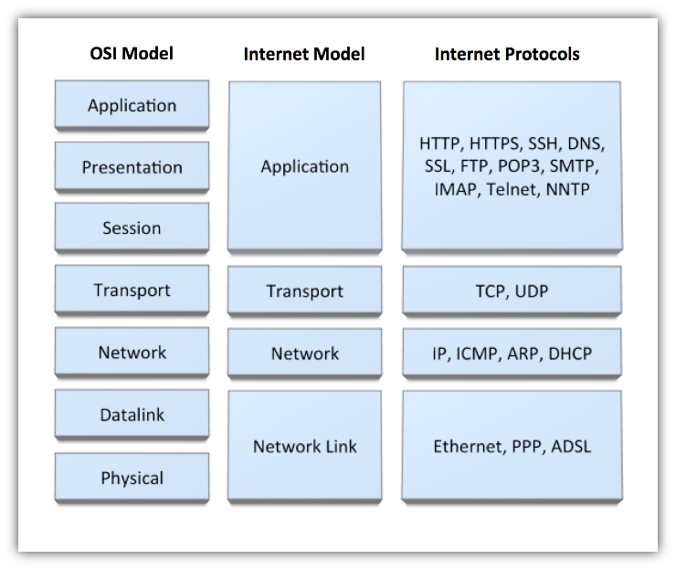

# OSI layer

1. 물리 계층(Physical layer)은 네트워크의 기본 네트워크 하드웨어 전송 기술을 이룬다. 네트워크의 높은 수준의 기능의 논리 데이터 구조를 기초로 하는 필수 계층이다. 다양한 특징의 하드웨어 기술이 접목되어 있기에 OSI 아키텍처에서 가장 복잡한 계층으로 간주된다.
 
1. 데이터 링크 계층(Data link layer)은 포인트 투 포인트(Point to Point) 간 신뢰성있는 전송을 보장하기 위한 계층으로 CRC 기반의 오류 제어와 흐름 제어가 필요하다. 네트워크 위의 개체들 간 데이터를 전달하고, 물리 계층에서 발생할 수 있는 오류를 찾아 내고, 수정하는 데 필요한 기능적, 절차적 수단을 제공한다. 주소 값은 물리적으로 할당 받는데, 이는 네트워크 카드가 만들어질 때부터 맥 주소(MAC address)가 정해져 있다는 뜻이다. 주소 체계는 계층이 없는 단일 구조이다. 데이터 링크 계층의 가장 잘 알려진 예는 이더넷이다. 이 외에도 HDLC나 ADCCP 같은 포인트 투 포인트(point-to-point) 프로토콜이나 패킷 스위칭 네트워크나 LLC, ALOHA 같은 근거리 네트워크용 프로토콜이 있다. 네트워크 브릿지나 스위치 등이 이 계층에서 동작하며, 직접 이어진 곳에만 연결할 수 있다.

1. 네트워크 계층(Network layer)은 여러개의 노드를 거칠때마다 경로를 찾아주는 역할을 하는 계층으로 다양한 길이의 데이터를 네트워크들을 통해 전달하고, 그 과정에서 전송 계층이 요구하는 서비스 품질(QoS)을 제공하기 위한 기능적, 절차적 수단을 제공한다. 네트워크 계층은 라우팅, 흐름 제어, 세그멘테이션(segmentation/desegmentation), 오류 제어, 인터네트워킹(Internetworking) 등을 수행한다. 라우터가 이 계층에서 동작하고 이 계층에서 동작하는 스위치도 있다. 데이터를 연결하는 다른 네트워크를 통해 전달함으로써 인터넷이 가능하게 만드는 계층이다. 논리적인 주소 구조(IP), 곧 네트워크 관리자가 직접 주소를 할당하는 구조를 가지며, 계층적(hierarchical)이다.
서브네트의 최상위 계층으로 경로를 설정하고, 청구 정보를 관리한다. 개방형 시스템들의 사이에서 네트워크 연결을 설정, 유지, 해제하는 기능을 부여하고, 전송 계층 사이에 네트워크 서비스 데이터 유닛(NSDU : Network Service Data Unit)을 교환하는 기능을 제공한다.

1. 전송 계층(Transport layer)은 양 끝단(End to end)의 사용자들이 신뢰성있는 데이터를 주고 받을 수 있도록 해 주어, 상위 계층들이 데이터 전달의 유효성이나 효율성을 생각하지 않도록 해준다. 시퀀스 넘버 기반의 오류 제어 방식을 사용한다. 전송 계층은 특정 연결의 유효성을 제어하고, 일부 프로토콜은 상태 개념이 있고(stateful), 연결 기반(connection oriented)이다. 이는 전송 계층이 패킷들의 전송이 유효한지 확인하고 전송 실패한 패킷들을 다시 전송한다는 것을 뜻한다. 가장 잘 알려진 전송 계층의 예는 TCP이다.
종단간(end-to-end) 통신을 다루는 최하위 계층으로 종단간 신뢰성 있고 효율적인 데이터를 전송하며, 기능은 오류검출 및 복구와 흐름제어, 중복검사 등을 수행한다.

1. 세션 계층(Session layer)은 양 끝단의 응용 프로세스가 통신을 관리하기 위한 방법을 제공한다. 동시 송수신 방식(duplex), 반이중 방식(half-duplex), 전이중 방식(Full Duplex)의 통신과 함께, 체크 포인팅과 유휴, 종료, 다시 시작 과정 등을 수행한다. 이 계층은 TCP/IP 세션을 만들고 없애는 책임을 진다. 통신하는 사용자들을 동기화하고 오류복구 명령들을 일괄적으로 다룬다.

1. 표현 계층(Presentation layer)은 코드 간의 번역을 담당하여 사용자 시스템에서 데이터의 형식상 차이를 다루는 부담을 응용 계층으로부터 덜어 준다. MIME 인코딩이나 암호화 등의 동작이 이 계층에서 이루어진다. 예를 들면, EBCDIC로 인코딩된 문서 파일을 ASCII로 인코딩된 파일로 바꿔 주는 것이 표현 계층의 몫이다.

1. 응용 계층(Application layer)은 응용 프로세스와 직접 관계하여 일반적인 응용 서비스를 수행한다. 일반적인 응용 서비스는 관련된 응용 프로세스들 사이의 전환을 제공한다. 응용 서비스의 예로, 가상 터미널(예를 들어, 텔넷), "Job transfer and Manipulation protocol" (JTM, 표준 ISO/IEC 8832) 등이 있다.

> Internet Model

> Socket Workflow

# tcp/udp

> 전송 제어 프로토콜(Transmission Control Protocol, TCP, 문화어: 전송조종규약)은 인터넷 프로토콜 스위트(IP)의 핵심 프로토콜 중 하나로, IP와 함께 TCP/IP라는 명칭으로도 널리 불린다. TCP는 근거리 통신망이나 인트라넷, 인터넷에 연결된 컴퓨터에서 실행되는 프로그램 간에 일련의 옥텟을 안정적으로, 순서대로, 에러없이 교환할 수 있게 한다.

<http://mr-zero.tistory.com/36>

> 사용자 데이터그램 프로토콜(User Datagram Protocol, UDP)은 인터넷 프로토콜 스위트의 주요 프로토콜 가운데 하나이다. UDP의 전송 방식은 너무 단순해서 서비스의 신뢰성이 낮고, 데이터그램 도착 순서가 바뀌거나, 중복되거나, 심지어는 통보 없이 누락시키기도 한다. UDP는 일반적으로 오류의 검사와 수정이 필요 없는 애플리케이션에서 수행할 것으로 가정한다.

<http://mr-zero.tistory.com/32?category=439699>

# asio

> 네트워크는 운영체제와 깊은 관련이 있어서 윈도우와 리눅스의 구현이 다르다.
이를 통일해서 멀티 플랫폼을 적용해주면서도, 비동기를 지원하며 (epoll, iocp), 각 운영체제가 지원하는 api를 c++ 14에서 유행중인 형식인 모던하게 작성되었다.